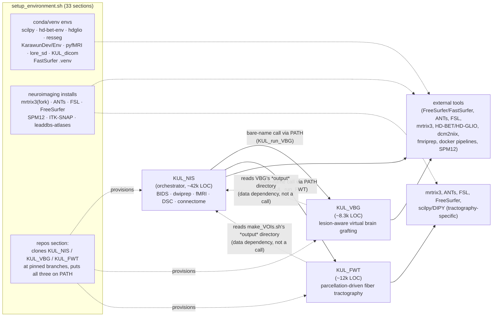

# KUL_software — architecture overview

Hand-authored, kept small on purpose (~30 nodes) — this is the "orient in 30
seconds" view. For the exhaustive machine-generated call graph, see
`data/graph.json` and the interactive explorer (`../explorer.html`). For
per-project detail, see `kul_nis_overview.md`, `kul_vbg_overview.md`,
`kul_fwt_overview.md` in this directory.

## The shape: one installer, three pipelines, hub-and-spoke calls

`KUL_software` (this checkout, upstream name `KUL_Linux_setup`) is an
install root: `setup_environment.sh` provisions ~30 third-party neuroimaging
tools and clones three KUL-authored pipelines into `src/`. Of those three,
`KUL_NIS` is the orchestrator — it calls into `KUL_VBG` and `KUL_FWT` as
subprocesses (bare script name, resolved via `PATH`); neither of the other
two ever calls back into KUL_NIS or into each other. Confirmed by grep across
all three repos, not just KUL_NIS's own comments.

Notes on the two dotted "reads ... output" edges: `KUL_dsc_perfusion.sh`,
`KUL_karawun_prepare.sh`, and `share/rsfmri_pipeline/src/step0_synthseg.sh`
(all in KUL_NIS) read files out of KUL_VBG's output tree — that's a
filesystem/data contract, not a function call, and it doesn't contradict the
hub-and-spoke shape above (KUL_NIS is still the only one issuing calls).

## Why bare-name calls, not paths

`setup_environment.sh`'s `repos` section clones all three pipelines into
`$SOFTWARE_ROOT/src/{KUL_NIS,KUL_VBG,KUL_FWT}` and its own comment states the
real mechanism: **all three directories go on `PATH`**, and cross-script
calls — both cross-project (KUL_NIS → KUL_VBG/KUL_FWT) and many intra-project
ones — use the bare script name, not a relative or absolute path. One
documented sharp edge: KUL_FWT's own scripts must resolve on `PATH` *before*
`KUL_clinical_fmridti.sh` runs — there's no automatic fallback to a sibling
`../KUL_FWT` directory. This is why the dependency graph can't be built from
`source`/explicit-path greps alone — most of it only exists as literal
script-name text inside `task_in="..."`-style command strings, resolved at
runtime by whatever's first on `PATH`. See `codebase_map/PLAN.md` §3 and
`codebase_map/notes/setup_environment_analysis.md` for the full mechanism.

## Where each pipeline's external-tool weight sits

| | heaviest external dependencies |
|---|---|
| KUL_NIS | fmriprep, FreeSurfer/FastSurfer, ANTs, mrtrix3(dwiprep family), docker pipelines (qsiprep/mrtrix_connectome/synb0/hd-glio-auto), SPM12/nilearn (fMRI GLM), dcm2niix/dcm2bids |
| KUL_VBG | FreeSurfer/FastSurfer (recon-all, SynthSeg/SynthStrip), ANTs (registration-heavy), mrtrix3 (labelconvert), FSL |
| KUL_FWT | mrtrix3 (tckgen/tckedit/5ttgen — tractography core), scilpy/DIPY (bundle filtering, profiling, screenshots), ANTs (registration to template space), FreeSurfer (aparc+aseg input) |

## Conda/venv env ownership (who provisions what a pipeline stage activates)

Pipelines don't call `setup_environment.sh` sections directly — a stage
`conda activate`s an env by name (sometimes via a `KUL_*_ENV` variable
defaulted in `KUL_main_functions.sh`) and assumes the installer already
created it. See `setup_environment_analysis.md` for the full table; the
short version: `scilpy`, `hd-bet-env`, `hdglio`, `resseg`, `KarawunDev`/
`KarawunEnv`, `pyfMRI`, `lore_sd`, `KUL_dicom` are dedicated envs; dcm2niix/
dcm2bids and the clinical DICOM Python deps deliberately install into
miniforge's **base** env instead; FastSurfer uses its own `uv`-managed
`.venv`, not conda at all.
