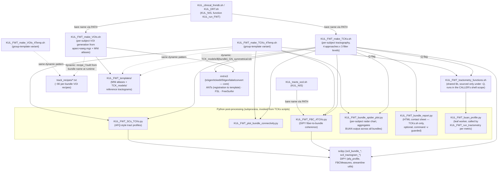

# KUL_FWT — pipeline overview

Two-stage pipeline (VOIs, then tractography), each with a per-subject and a
group-template variant. All four top-level scripts share the "assign
command line to `task_in`, `eval` it via `task_exec`" idiom — the extractor
resolves these by scanning the whole file text, not just line-start
commands (see `codebase_map/PLAN.md` §3).

## Standalone, never called by any `.sh`/`.py` in this project

`KUL_FWT_morphometrics.py`, `KUL_FWT_plot_fixel_bundle_metrics.py`,
`KUL_FWT_TCKsm_cap.py` (unfinished scaffold), `KUL_Voxel_mask_segment.py` —
manual/notebook tools, not part of the automated pipeline. `dev_work/` holds
earlier iterations of `KUL_Voxel_mask_segment.py` plus scratch test images;
`KUL_FWT_dev_work/` holds a design-audit markdown, not code.

## Two bugs worth knowing about (found during inventory, not by the extractor)

- **`KUL_FWT_make_VOIs_4Temp.sh` self-locates via the wrong script name** —
  its `which KUL_FWT_make_VOIs.sh` call (line 221) looks up the *non*-`_4Temp`
  binary, apparently a copy-paste artifact. Only matters if the two scripts
  aren't both on `PATH` together.
- **`KUL_FWT_make_TCKs_4Temp.sh` doesn't call `KUL_FWT_bundle_report.py`**,
  unlike `KUL_FWT_make_TCKs.sh` — an undocumented asymmetry between the two
  variants (template runs get no HTML contact-sheet report).
