# KUL_NIS — pipeline overview

KUL_NIS has 45 top-level entry-point scripts — too many for one legible
diagram, so this groups them into the same families the inventory pass used
(`codebase_map/notes/inventory_KUL_NIS.md`), each anchored on its current
(non-deprecated) entry points. Every family that has a `.sh` entry point
sources `KUL_main_functions.sh` (~40 of 45 files) — drawn once, not repeated
per family, to keep this readable. Dev/deprecated/orphan scripts are listed
in a separate section rather than drawn, per the inventory's own
classification.

```mermaid
flowchart TB
    MAIN["KUL_clinical_fmridti.sh\n(master orchestrator, -t 1-7)"]
    LIB["KUL_main_functions.sh\n(shared lib: KUL_task_exec, conda env bootstrap)"]
    VIEW["KUL_mrview_figure.sh\n(shared QC-screenshot utility,\ncalled by ~10 other scripts as a subprocess)"]

    MAIN -.sources.-> LIB

    subgraph DCM["DICOM -> BIDS"]
        DCM2["KUL_dcm2bids.sh"]
    end
    subgraph DWI["dMRI preprocessing"]
        DWIPREP["KUL_dwiprep.sh"]
        DWIANAT["KUL_dwiprep_anat.sh"]
        DWIMNI["KUL_dwiprep_MNI.sh"]
        DWIFBA["KUL_dwiprep_group_fba.sh"]
        SYNB0["KUL_synb0.sh --> KUL_radsyndisco.sh (fallback)"]
    end
    subgraph FMRI["fMRI processing"]
        FCONN["KUL_fmriproc_conn.sh"]
        FNILEARN["KUL_fmriproc_nilearn_new.sh"]
        FSPM["KUL_fmriproc_spm_new.sh --> share/spm12/*.m (matlab, runtime-selected)"]
        FDENOISE["KUL_fmri_denoise.sh"]
        RSFMRI["KUL_run_rsfMRI_networks.sh --> share/rsfmri_pipeline/ (Python steps 0-5)"]
    end
    subgraph ANAT["Anatomical / registration"]
        AREG["KUL_anat_register.sh"]
        ABIAS["KUL_anat_biascorrect.sh"]
        ATUMOR["KUL_anat_segment_tumor.sh"]
        FSMULTI["KUL_FS_multiparc.sh"]
    end
    subgraph DSC["DSC perfusion"]
        DSCPERF["KUL_dsc_perfusion.sh --> share/dsc/KUL_dsc_fit.py"]
    end
    subgraph KARA["Tractography export"]
        KARAPREP["KUL_karawun_prepare.sh"]
        TRACTSOCD["KUL_tracts_ocd.sh"]
    end
    subgraph DOCKER["Docker-based pipelines"]
        QSIPREP["KUL_qsiprep.sh"]
        MRCONN["KUL_MRtrix3_connectome.sh"]
    end

    MAIN --> DCM2
    MAIN --> DWIPREP
    MAIN --> DWIANAT
    MAIN --> DWIMNI
    MAIN --> ATUMOR
    MAIN --> ABIAS
    MAIN --> AREG
    MAIN --> FSMULTI
    MAIN --> FCONN
    MAIN --> FNILEARN
    MAIN --> FSPM
    MAIN --> RSFMRI
    MAIN --> DSCPERF
    MAIN --> KARAPREP
    MAIN -- "DTI-ALPS type-7 workflow" --> ALPS["KUL_DTI_ALPS/KUL_calc_DTIALPS.sh"]

    DWIPREP --> SYNB0
    FCONN --> FDENOISE
    RSFMRI --> FDENOISE

    MAIN -- "KUL_run_VBG" --> VBG["KUL_VBG.sh (KUL_VBG project)"]
    MAIN -- "KUL_run_FWT" --> FWTVOI["KUL_FWT_make_VOIs.sh (KUL_FWT project)"]
    MAIN -- "KUL_run_FWT" --> FWTTCK["KUL_FWT_make_TCKs.sh (KUL_FWT project)"]
    TRACTSOCD -- cross-project --> FWTFBC["KUL_FWT_FBC_4TCKs.py (KUL_FWT project)"]

    KARAPREP -.reads output of.-> VBG
    DSCPERF -.reads output of.-> VBG
    RSFMRI -.reads output of.-> VBG

    ATUMOR --> VIEW
    DWIPREP --> VIEW
    DWIANAT --> VIEW
    DSCPERF -.optional, command -v guarded.-> VIEW
```

## Dev / deprecated / orphan (not drawn above)

Per the inventory pass — kept as graph nodes in `data/graph.json`, excluded
from the diagram to keep it legible:

- **Superseded**: `KUL_dwiprep_group_fba_bkup.sh` (by `KUL_dwiprep_group_fba.sh`),
  `KUL_karawun2brainlab.sh` (by `KUL_karawun_prepare.sh`), the stale
  `share/nilearn/KUL_fmriproc_nilearn_new.sh` copy (by the top-level one),
  `tools/KUL_DSC_analysis/{DSC_proc_script_WIP3.sh,Good_DSCLC_fit5.py}` (by
  `KUL_dsc_perfusion.sh` + `share/dsc/KUL_dsc_fit.py`).
- **WIP/broken**: `KUL_lesion_fs_recall.sh` ("dev Alpha", superseded by
  KUL_VBG), `KUL_radsyndisco.sh` (TODO-laden, undefined `$sbzd_p2` path),
  `KUL_VSC_prepare_dwiprep.sh` (malformed shebang, undefined vars, missing
  template file).
- **Hardcoded one-offs**: `KUL_conn_make_nets.sh`, `KUL_reg_pwi_2_T1.sh`
  (personal path baked in), `KUL_dwiprep_fibertract.sh`, `KUL_dwiprep_FT.sh`
  (named-project scripts).
- **Orphans** (no caller found anywhere in this scan): `KUL_dcm2bids.py`,
  `KUL_BIDS_clean.py`, `KUL_eddy_squad.py` — manual/QC tools, run by hand.
- **Doc/code mismatch worth knowing about**: `KUL_FS_multiparc.sh`'s header
  comment claims its atlases "live in sibling KUL_VBG_latest repo" — the
  code actually reads its own local `KUL_NIS/atlases/`. No real KUL_VBG
  dependency here despite the comment.
