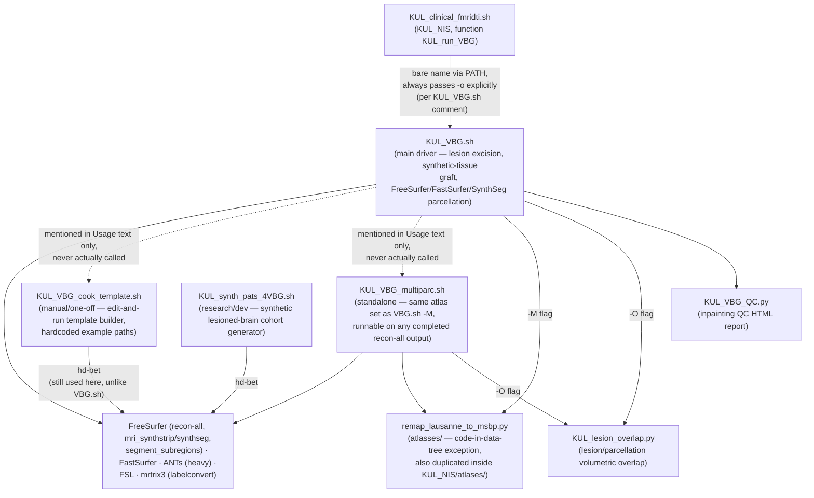

# KUL_VBG — pipeline overview

Four independent entry points — none call each other programmatically
(`KUL_VBG.sh`'s own usage text mentions the other three, but the code never
invokes them; confirmed by the extractor finding no such edges after
comment-stripping). Every one defines its own local `task_exec`/`run`
function rather than sharing one library — unlike KUL_NIS, there's no
`KUL_main_functions.sh` equivalent here.

## Notable details not shown above

- **HD-BET was removed from `KUL_VBG.sh` itself** (changelog-documented) but
  is still actively used in `KUL_VBG_cook_template.sh` and
  `KUL_synth_pats_4VBG.sh` — an inconsistency across the project's own
  scripts, not a bug in the graph.
- **Self-location is PATH-dependent**: `KUL_VBG.sh` finds its own directory
  via `which KUL_VBG.sh`, `KUL_VBG_multiparc.sh` via the more robust
  `$(dirname "${BASH_SOURCE[0]}")`. A symlink or full-path invocation of
  `KUL_VBG.sh` would silently break its template/atlas/LUT lookups.
- **`Docker/`** (Dockerfile, entrypoint.sh, build.sh, KUL_VBG.def) is
  packaging metadata, not part of this call graph — see
  `notes/inventory_KUL_VBG.md` for what it vendors (ANTs, mrtrix3 fork, FSL,
  FreeSurfer 8.2.0, FastSurfer, all pinned to specific commits).
